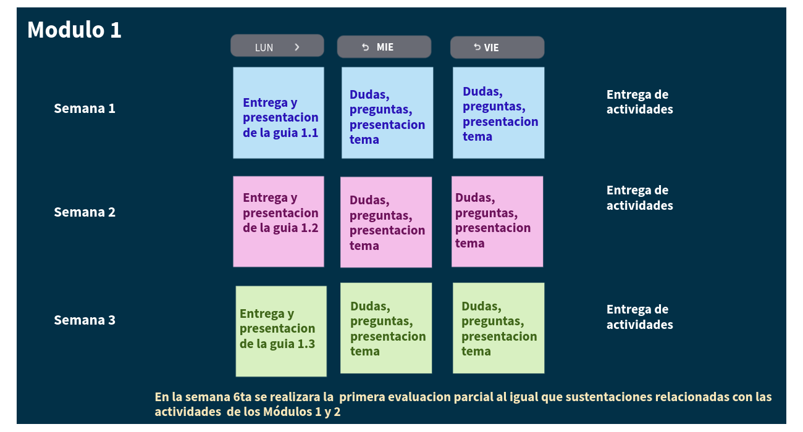
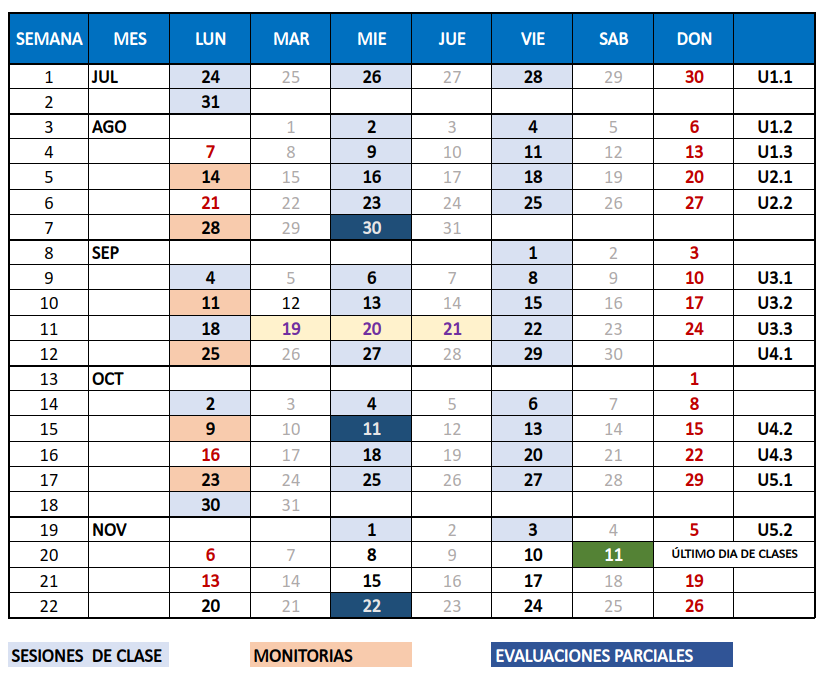
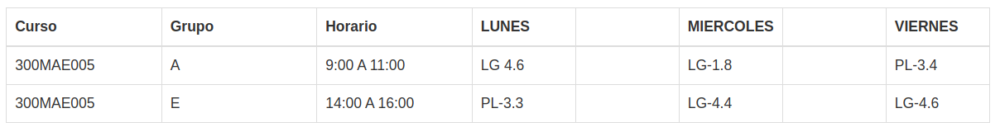
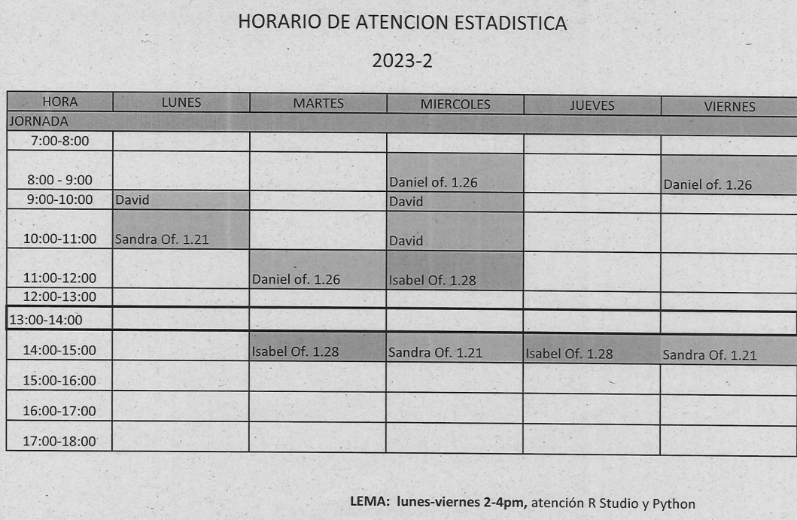
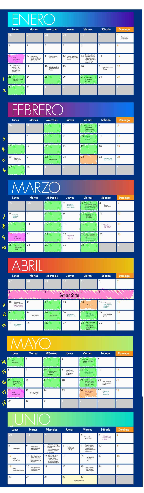

```{r setup, include=FALSE}
knitr::opts_chunk$set(echo = TRUE)
cg="#6c4675"

```

# **300MAE005**

<br/><br/>


```{r, echo=FALSE, out.width="100%", fig.align = "center"}
knitr::include_graphics("img/bannerG.png")
```


<br/><br/><br/>


```{r, echo=FALSE, out.width="100%", fig.align = "center"}
 knitr::include_graphics("img/modulos.png")
```
<br/><br/>

# **Metodología**
 
```{r, echo=FALSE, out.width="100%", fig.align = "center"}

```
<br/><br/><br/>


# **Calendario 2023-2**

<br/><br/>


```{r, echo=FALSE, out.width="100%", fig.align = "center"}

```

<br/><br/>


# **Salones**


<!-- |Curso     | **Grupo** | Horario       | **LUNES**  | $\hspace{1cm}$ | **MIERCOLES** | $\hspace{1cm}$ | **VIERNES** | -->
<!-- |:---------|:----------|:--------------|:-----------|:-------|:--------------|:-------|:------------| -->
<!-- |300MAE005 |  **A**    | 9:00 A 11:00  | **LG 4.6** |        | **LG-1.8**    |        | **PL-3.4**  | -->
<!-- |          |           |               |            |        |               |        |             | -->
<!-- |300MAE005 |  **E**    | 14:00 A 16:00 | **PL-3.3** |        | **LG-4.4**    |        | **LG-4.6**  | -->
<!-- |          |           |               |            |        |               |        |             | -->


```{r, echo=FALSE, out.width="100%", fig.align = "center"}
 
```

<br/><br/>

# **Atención a Estudiantes**


```{r, echo=FALSE, out.width="70%", fig.align = "center"}

```

<br/><br/>

# **Información supletorios**


```{r, echo=FALSE, out.width="70%", fig.align = "center"}
 knitr::include_graphics("img/supletorio1.png")
```

<br/><br/>


```{r}

```


```{r, echo=FALSE, out.width="100%", fig.align = "center"}
# 
```

# Resultados 

## Primer parcial


```{r, echo=FALSE, out.width="100%", fig.align = "center"}
# Instala y carga los paquetes necesarios
# install.packages("ggplot2")
library(ggplot2)

# Define los datos
datos <- data.frame(pp=c(2.8,4.4,3.9,4.8,5,3.5,4.4,3.9,4.2,2.9,3.6,4.1,4.3,3.5,4.4,3,3.9,4.5,3.8,4.7,4.2,4.6,3.5,2.7,4.9,4,4,5,4.7,3,3.9,4.1,4.5,4.6,3.9,3.7,4.7,3.9,4.2,4.6,3.5,4,4.8,3,4.8,4.6,3.9,4.9,4.7,4.4,4.1,4.8,4.6,4,4.1,4,3.5,3.5,3.9,4.2),
                  grup=rep(c("A", "E"), each=30)
)

# Crear el boxplot con ggplot2 y añadir puntos
ggplot(datos, aes(x = grup, y = pp, fill = grup)) +
  geom_boxplot(alpha = 0.5, width = 0.5) +
  geom_jitter(position = position_jitter(width = 0.3), color = "darkblue", alpha = 0.5) +
  geom_hline(yintercept = 3, color = "red") +
  labs(title = "Boxplot de datos por grupo",
       x = "Grupo",
       y = "Valor") +
  scale_fill_manual(values = c("#FDA300", "#1F4762")) +
  theme_minimal()

```


```{r, echo=FALSE, out.width="100%", fig.align = "center"}
# Mostrar el resumen descriptivo
summarytools::descr(datos$pp)

```

### Relación de la nota del primer parcial con el promedio académico

```{r, echo=FALSE, out.width="100%", fig.align = "center"}
# Instala y carga el paquete ggplot2 si aún no está instalado
#  install.packages("ggplot2")
library(ggplot2)
library(plotly)

# Define los datos
datos <- data.frame(
  pp = c(2.8,4.4,3.9,4.8,5,3.5,4.4,3.9,4.2,2.9,3.6,4.1,4.3,3.5,4.4,3,3.9,4.5,3.8,4.7,4.2,4.6,3.5,2.7,4.9,4,4,5,4.7,3,3.9,4.1,4.5,4.6,3.9,3.7,4.7,3.9,4.2,4.6,3.5,4,4.8,3,4.8,4.6,3.9,4.9,4.7,4.4,4.1,4.8,4.6,4,4.1,4,3.5,3.5,3.9,4.2),
  grup = rep(c("A", "E"), each = 30),
  proaca = c(3.75,3.9,4.41,4.34,4.72,3.91,4.17,4.22,4.45,3.41,4.26,3.95,3.95,3.86,3.89,3.89,4.51,3.59,3.51,4.57,4.32,4.28,3.26,3.59,3.92,4.49,4.47,4.56,3.92,3.92,4.03,4.16,4.14,4.45,3.99,4.16,3.8,3.8,3.95,3.86,3.85,4.07,3.75,3.29,4.45,3.99,4.01,4.71,3.58,4.11,4.12,4.01,4.41,3.54,3.88,4.36,4.07,3.46,4.31,4.31)
)

# Crear el gráfico con ggplot2
ggplot_grafico <- ggplot(datos, aes(x = proaca, y = pp, color = grup)) +
  geom_point() +
  geom_point(size = 3) + 
  labs(title = "Gráfico de pp vs. proaca",
       x = "proaca",
       y = "pp") +
  scale_color_manual(values = c("A" = "#FDA300", "E"= "#1F4762")) +
  theme_minimal()

plotly_grafico <- ggplotly(ggplot_grafico)

plotly_grafico
```

```{r}
cor(datos$proaca, datos$pp)
```

