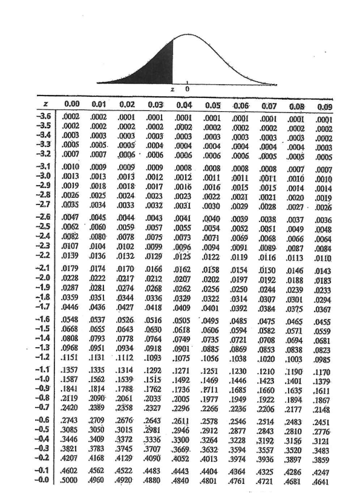
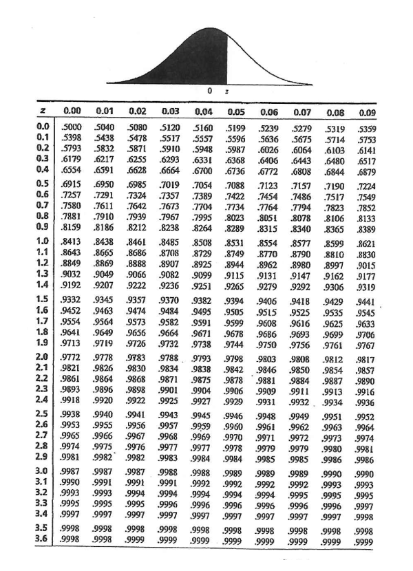
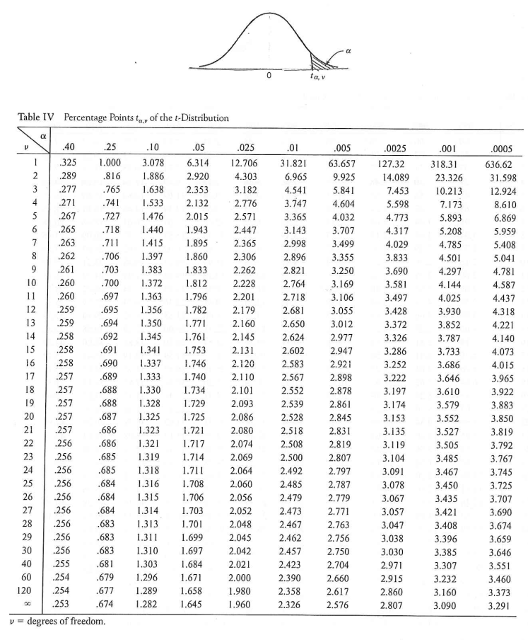
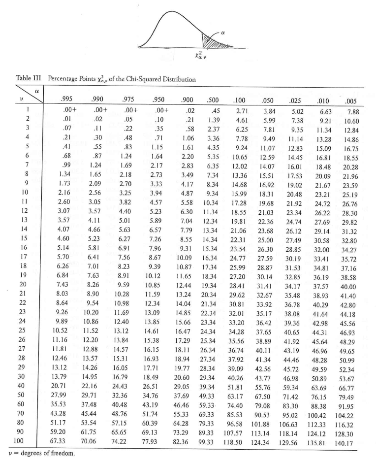
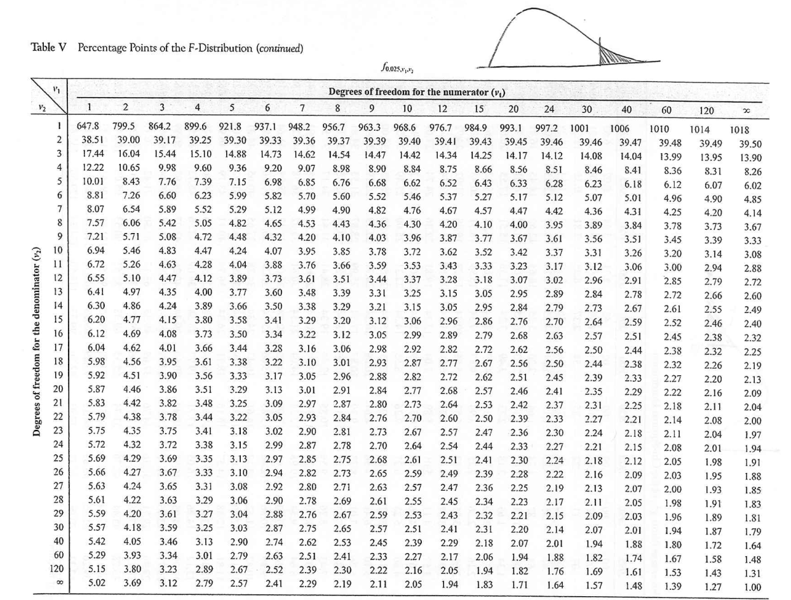
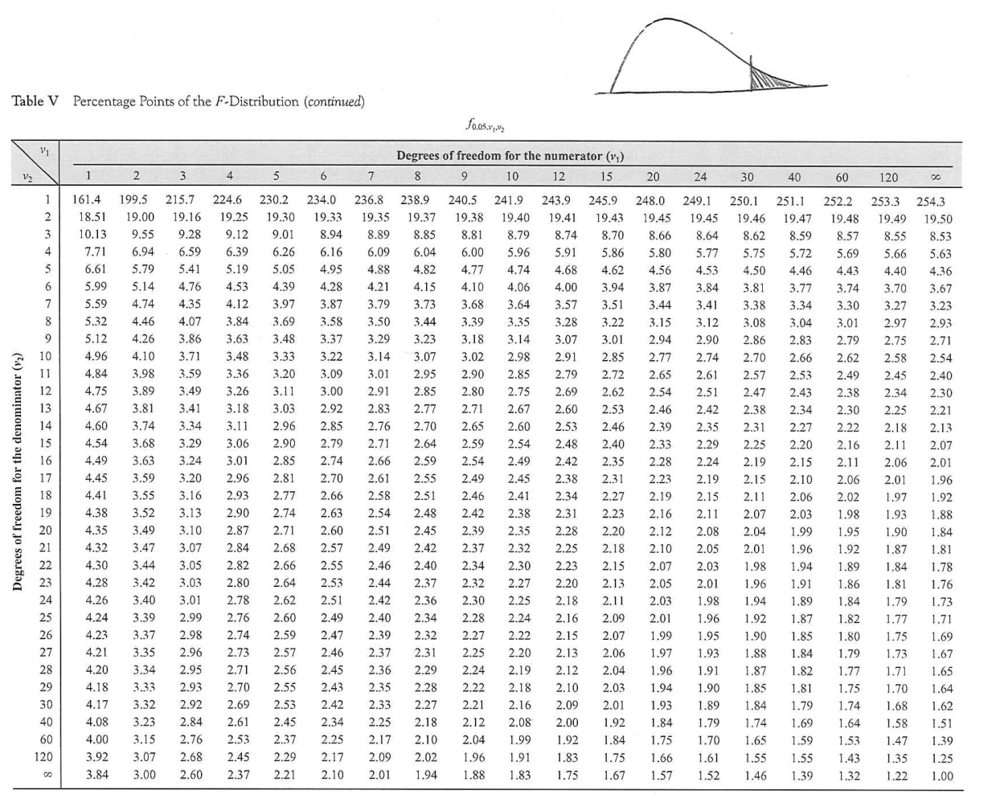

<br/><br/>


## **Tabla normal estandar**

```{r, echo=FALSE, out.width="100%", fig.align = "left"}

```


```{r, echo=FALSE, out.width="100%", fig.align = "left"}

```


<br/><br/>

## **Tabla t-Student**

```{r, echo=FALSE, out.width="100%", fig.align = "left"}

```

<br/><br/>

## **Tabla chi-cuadrado**

```{r, echo=FALSE, out.width="100%", fig.align = "left"}

```

<br/><br/>

## **Tabla F 0.025**

```{r, echo=FALSE, out.width="100%", fig.align = "left"}

```

<br/><br/>
## **Tabla F 0.05**

```{r, echo=FALSE, out.width="100%", fig.align = "left"}

```


<br/><br/>

