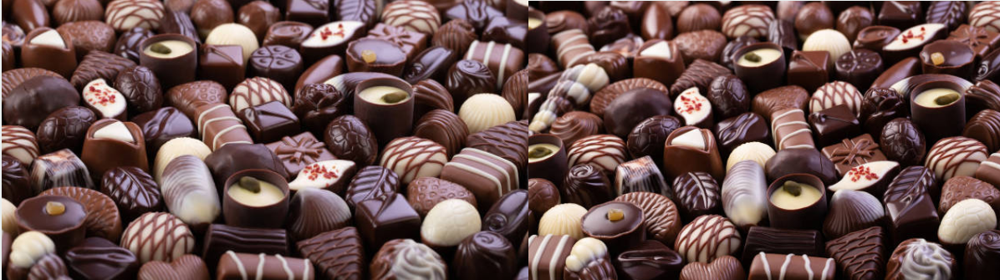

```{r setup, include=FALSE}
knitr::opts_chunk$set(echo = TRUE)

# colores
c0= "#b0394a"
c1= "#ad6395"
c2= "#a391c4"
c3= "#8acfe6"
c4= "#646420"
c5= "#db524f"
```


<br/>

<br/><br/>

<!-- # <span style="color:#8acfe6">**Problema**</span> -->

```{r, echo=FALSE, out.width="100%", fig.align = "left"}

```

Una compañia dulcera distribuye cajas de chocolates con un surtido de **cremas**, **chiclosos** y **envinados**. Suponga que el peso de cada caja es 1 kilogramo; pero los pesos individuales de cremas, chiclosos y envinados varian de una caja a otra. Para una caja seleccionada al azar, sea $X$ y $Y$ los pesos de las cremas y los chiclosos, respectivamente, y suponga que la función de densidad conjunta de estas variables está representada por:

<br/>

$$
f(x,y) = 
\begin{cases}
24 xy,\hspace{.5cm}\text{si } & 0 \leq x \leq 1,\\ 
                   & 0 \leq y \leq1, \\
                   & x+y\leq 1\\
0 \hspace{1.2cm} & \text{en cualquier otro caso} \\
\end{cases}
$$
<br/>

* Encuentre la probabilidad de que en una caja dada los envinados representen más de la mitad del peso

<br/>

* Encuentre la función de densidad marginal para el peso de las cremas

<br/>

* Encuentre la probabilidad de que el peso de los chiclosos en una caja sea menor que 1/8 de kilogramo, si se sabe que las cremas constituyen más de 3/4 del peso.

<br/>

* Encuentre la correlación entre ambas variables.

<br/><br/><br/>
