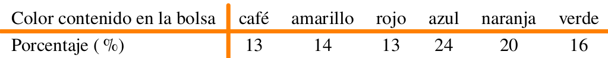

```{r setup, include=FALSE}
knitr::opts_chunk$set(echo = TRUE, comment = NA)
```


<br/>

## **Problema 1**

<br/>

Suponga que se estudia la compra de una nueva maquina para una empresa. Se comprara la maquina si la proporción de la producción que necesita ser reprocesados por tener defectos es inferior al 5 %. Se examina una muestra de 40 artículos construidos por la maquina y 3 necesitan ser reprocesados . ¿ Que decisión se toma? ( Se compra o no la maquina?)

<br/><br/><br/>


## **Problema 3**

Los ingenieros de una ensambladora de automóviles requieren decidir sobre cuál de dos de las marcas de neumáticos deben comprar. La marca FB o la marca KT. Con el fin de tomar una decisión basada en evidencias estadísticas, deciden realizar un experimento en el que usan 12 neumáticos de cada marca. Los neumáticos se utilizan hasta su terminación. Los resultados obtenidos son los siguientes:

```{r}
library(ggplot2)
FB =c(41.8, 41.6, 31.5, 48.7, 40.8, 31.2, 36.5, 36.2, 32.8, 36.3, 38.6, 30.5)
KT =c(40.5, 38.4, 44.0, 34.9, 44.0, 44.7, 44.0, 47.1, 39.8, 43.9, 44.2, 40.2)

llantas = data.frame(rendimiento =c(FB, KT),
                     marca = rep(c("FB","KT"), each=12 ))

# Crear el boxplot con ggplot2
ggplot(llantas, aes(x = marca, y = rendimiento, fill = marca)) +
  geom_boxplot() +
  geom_point(position = position_jitterdodge(jitter.width = 0.2), size = 3) +
  labs(x = "Marca", y = "rendimiento") +
  scale_fill_manual(values = c("FB" = "lightblue", "KT" = "lightgreen")) +
  theme_minimal()


```


Cuál marca de neumáticos recomendaría comprar. Justifique su respuesta. Suponga que la distancia recorrida por un neumático se distribuye aproximadamente normal y un $\alpha$ = 0,05.

<br/><br/><br/>

## **Problema 4**

Un ingeniero desea establecer si existen diferencias entre dos métodos diferentes de realizar el ensamble de una casa prefabricada. Para comprobarlo recoge información la producción de ambos métodos que se presentan a continuación: \\

```{r}

x1 = c(32, 37, 35, 28, 41, 44, 35, 31, 34) # Procedimiento estándar:
x2 = c(35, 31, 29, 25, 34, 40, 27, 32, 31) # Nuevo procedimiento:

datos = data.frame(metodo = rep(c("método 1", "método 2"), each= 9),
                   produccion = c(x1,x2))

# Crear el boxplot con ggplot2
ggplot(datos, aes(x = metodo, y = produccion, fill = metodo)) +
  geom_boxplot() +
  geom_point(position = position_jitterdodge(jitter.width = 0.2), size = 3) +
  labs(x = "método", y = "prodicción") +
  scale_fill_manual(values = c("método 1" = "lightblue", "método 2" = "lightgreen")) +
  theme_minimal()


```
	

	
Presentan los datos suficiente evidencia estadística para afirmar que el nuevo método es más eficiente que el estándar? (utilice un $\alpha=0.05$).

<br/><br/><br/>

## **Problema 5**

Un director de un gimnasio quiere determinar si un instructor de ejercicio debe ser contratado o no para su campaña estrella “Reducción de peso”, Para tomar la decisión le dice que pruebe con 16 de las personas que habitualmente concurren tomadas al azar. Los datos que se tomaron antes ($x_{1}$) y después ($x_{2}$) de haber realizado un mes de ejercicios son los siguientes:
	
|id     | 1  | 2  |  3 | 4  | 5  | 6  | 7  | 8  | 9  | 10 | 11 | 12 | 13 | 14 | 15 | 16 |
|------:|---:|---:|---:|---:|---:|---:|---:|---:|---:|---:|---:|---:|---:|---:|---:|---:|                 
|$x_{1}$|104 | 89 | 84 | 106| 90 | 96 | 79 | 90 | 85 | 76 | 91 | 82 | 100| 89 | 121| 72 | 
|$x_{2}$| 98 | 85 | 85 | 103| 88 | 95 | 79 | 90 | 82 | 76 | 89 | 81 |  99| 86 | 111| 70 | 


		
Emplee y realice las pruebas de hipótesis a un nivel de significancia del 0.01 para determinar si el programa que ofrece el nuevo instructor es eficaz. Suponga que la variable peso se distribuye aproximadamente normal.

<br/><br/><br/>

## **Problema 6**

Se realizan pruebas de un nuevo lector láser manual para uso en inventarios y el lector utilizado actualmente, con el fin de decidir si se adquiere el primero. Se obtienen los datos siguientes sobre el número de códigos de barra de 7 pulgadas que pueden leerse por segundo. Sea $X_{1}$: número de códigos leído por segundo con el dispositivo nuevo y $X_{2}$ el correspondiente al dispositivo antiguo.

	
$n_{1}=61$ ;\hspace{1cm} $\bar{x}_{1}=40$ ;\hspace{1cm} $s^{2}_{1}=24.9$ 
$n_{2}=61$ ; \hspace{1cm}$\bar{x}_{2}=29$ ;\hspace{1cm} $s^{2}_{2}=22.7$ 

	
De acuerdo con la información suministrada, es posible preferir alguno de ellos?. En caso de poderlo realizar con cual se quedaría? Justifique su respuesta. En cada caso determine las pruebas de hipótesis, el estadístico de prueba apropiado, el $valor-p$ obtenido y las conclusiones resultantes.
	
	
<br/><br/>
	
### **Ayuda**

<pre>
n1=61
n2=61
mx1=40
mx2=29
vx1=24.9
vx2=22.7

F=vx1/vx2
qf(c(0.025,0.975),60,60)

sp2=(n1*vx1+n2*vx2)/sqrt(n1+n2-2)
T=(mx1-mx2)/sqrt(sp2*(1/n1+1/n2)
qt(c(0.025,0.975), n1+n2-2)
</pre>
<br/><br/>

<br/><br/><br/>

## **Problema 7**

Un empresario registro el número de artículos producidos durante 10 días, para un grupo de 15 obreros que trabajaban con base en un salario fijo (Grupo 1). El industrial introdujo un plan de incentivos para otros 15 obreros y registro su producción durante otros 10 días (Grupo 2). El número de artículos producidos por cada uno de los grupos fue :   \\

|    |     |     |     |     |     |     |     |     |    |     |	
|:---|----:|----:|----:|----:|----:|----:|----:|----:|---:|----:|
|G1  | 75  |  76 |  74 |  80 |  72 |  78 |  76 |  73 |  72|  75 |      
|G2  | 86  |  78 |  86 |  84 |  81 |  79 |  78 |  84 |  88|  80 |  

	
Suponiendo que los salarios pagados a cada grupo son equivalentes. Se puede concluir que el plan de incentivos es efectivo?

<br/><br/><br/>

## **Problema 8**

En una muestra de 200 clientes, el 20\% indica una preferencia por tamaño especial de pizza.  Con posterioridad a una campaña publicitaria realizada en radio y televisión promoviendo dicho producto, se selecciono una muestra de igual tamaño.  En esta ultima muestra el 22\% de los clientes indico preferencia por el producto. De acuerdo con estos resultados y un nivel de significancia del 5\% , podría decirse que la campaña publicitaria no fue efectiva? 

<br/><br/><br/>

## **Problema 9**	

Los siguientes son los datos de las horas hombre que se pierden en promedio por accidentes en 10 plantas industriales antes (A) y después (D) de la implantación de un programa de seguridad industrial:\\
	
|id  | 1  |  2 | 3  | 4  |  5  | 6  | 7  | 8  | 9  | 10 | 
|:---|---:|---:|---:|---:|----:|---:|---:|---:|---:|---:|
|	A  | 45 | 73 | 46 | 124 | 30 | 57 | 83 | 34 | 26 | 17 | 
|	D  | 36 | 60 | 44 | 119 | 35 | 51 | 77 | 29 | 24 | 11 |   

Utilice un nivel de significancia de 0.05 para probar si el programa de seguridad implantado es eficaz. Suponga que esta variable se distribuye aproximadamente normal.

<br/><br/><br/>

## **Problema 10**	


La compañía de dulces Mars publica en su sitio web información relacionada con los porcentajes de los distintos colores de sus dulces M\|M para la variedad de chocolate con leche.

<br/><br/>

```{r, echo=FALSE, out.width="60%", fig.align = "center"}

```

<br/><br/>

<!-- |Color contenido en la bolsa | café       | amarillo  | rojo    | azul     | naranja  | verde     | -->
<!-- |:---------------------------|:----------:|:---------:|:-------:|:--------:|:---------|:---------:| -->
<!-- |Porcentaje (\%)             | 13         | 14        | 13      | 24       | 20       | 16        | -->

	
Se realiza una verificación mediante el conteo delos dulces contenidos e n una bolsa de 14 onzas de dulces M\|M, obteniendo los siguientes resultados: 70 duces cafés, 72 amarillos, 61 rojos, 118 azules, 108 naranjas y 85 verdes. 
	
Se podria afirmar que los datos anteriores respaldan la información suministrada por la compañía en su sitio web? Sustente su respuesta.
	

<br/><br/><br/>

## **Problema 11**	

En una línea de producción los artículos se inspeccionan en forma periódica con el fin de detectar defectos. La siguiente secuencia de artículos defectuosos (D) y no defectuosos (N) corresponde a la producción de uno de los turnos. 
```{r}
inspeccion = sample(c("D", "N"), 50, replace = TRUE)
inspeccion
```


Se puede afirmar que los datos no presentan patrón alguno y que la generación de artículos defectuosos se debe al azar? . Utilice un  $\alpha= 0.05$.

<br/><br/><br/>

## **Problema 12**
	
En una planta ensambladora de camiones la supervisión diaria de las soldaduras generó la siguiente información :

<br/><br/>

```{r, echo=FALSE, out.width="35%", fig.align = "center"}
knitr::include_graphics("img/tabla_p12.png")
```

<br/><br/>

```{r}
x=c(470,445,257,191,171,139,42,28,17)
m=matrix(x, ncol = 3)
colnames(m) = c("alta", "moderada", "baja")
rownames(m) = c("dia", "tarde", "noche")
m
```


¿Se puede concluir que la calidad varia con los turnos?, en otras palabras se puede concluir que la calidad de las soldaduras es independiente de los turnos? . Utilice un nivel de significancia $\alpha=0.05$.
	
<br/><br/><br/>

## **Problema 13**

Los siguientes datos corresponde a las notas obtenidas por un grupo de estudiantes de la asignatura Matemáticas Fundamentales. Si la distribución de los datos es normal, podría afirmar que la prueba realizada es una prueba normalizada. En caso contrario serviría para estudiar problemas relacionados con su aprendizaje. Para un $\alpha= 0;05$, se podría afirmar que los datos proceden de una distribución normal? . Si se requiere realizar una prueba de hipótesis sobre la media de la nota $H_{o}:\mu \leq 3.3$ vs $H_{a}: \mu > 3.3$, ¿Que prueba se realizaría? 


```{r}
x=c(3.4, 2.8, 4.2, 2.1, 2.8, 2.4, 3.5, 4.2, 3.1, 4.1, 2.4, 3.4, 4.1, 4.0, 2.4, 4.1, 3.4, 4.4, 3.8, 3.7, 2.2, 3.6, 2.3, 3.7, 2.8, 4.1, 2.3, 4.6, 4.6, 5.2, 2.4, 2.4, 2.7, 3.8, 4.6, 4.4, 4.2, 4.4, 2.4, 3.3, 3.8, 2.9, 3.1, 2.7, 3.6, 3.8, 4.4, 3.9, 2.8, 3.7)
x

	
```
	
<br/><br/><br/>

## **FORMULARIO PRUEBAS DE HIPÓTESIS PARAMÉTRICAS**


<br/><br/>

###  Una población

$$Z_{o} = \dfrac{\bar{X}-\mu_{o}}{\sigma/\sqrt{n}}\sim N(0,1)$$

<br/><br/>

$$Z_{o} = \dfrac{\bar{X}-\mu_{o}}{s/\sqrt{n}} \sim N(0,1)$$


<br/><br/>

$$T_{o}=\dfrac{\bar{X}-\mu_{o}}{s/\sqrt{n}} \sim t_{v=n-1}$$ 

<br/><br/>

$$X^{2}_{o}=\dfrac{(n-1)S^{2}}{\sigma_{o}^{2}} \sim \chi^{2}_{v=n-1}$$ 

<br/><br/>

$$Z_{o}= \dfrac{X-n \hspace{.1cm} p_{o}}{\sqrt{n \hspace{.1cm }p_{o}}} \sim N(0,1)$$
<br/><br/>

$$Z_{o}=\dfrac{\widehat{p}-p_{0}}{\sqrt{p_{o}(1-p_{o})/n}} \sim N(0,1)$$

<br/><br/>

$$Z_{o}|=|\dfrac{(\bar{x}_{1}-\bar{x}_{2})- \Delta_{o}}{\sqrt{\dfrac{\sigma_{1}^{2}}{n_{1}}+\dfrac{\sigma_{2}^{2}}{n_{2}}}} \sim N(0,1)$$
<br/><br/>

$$T_{o}= \dfrac{(\bar{x}_{1}-\bar{x}_{2})-\Delta_{o}}{s_{p}\sqrt{\dfrac{1}{n_{1}} + \dfrac{1}{n_{2}}}} \sim t_{v=n_{1}+n_{2}-2}$$

$$ \text{donde:} \hspace{1cm} s^{2}_{p}=\dfrac{(n_{1}-1)s_{1}^{2}+(n_{2}-1)s^{2}_{2}}{n_{1}+n_{2}-2}$$

<br/><br/>

$$T_{o}= \dfrac{(\bar{x}_{1}-\bar{x}_{2}-\Delta_{o}}{\sqrt{\dfrac{s^{2}_{1}}{n_{1}}+\dfrac{s^{2}_{2}}{n_{2}}}} \sim t_{v^{*}}$$

<br/><br/>

$$\text{donde:} \hspace{1cm} v^{*}= \dfrac{(s^{2}_{1}/n_{1} + s^{2}_{2}/n_{2})^{2}}{\dfrac{(s^{2}_{1}/n_{1})^{2}}{n_{1}-1}+\dfrac{(s^{2}_{2}/n_{2})^{2}}{n_{2}-1}}$$
<br/><br/>

$$T_{o}= \dfrac{\bar{d}-\Delta_{o}}{s_{d}^{2}} \sim t_{v=n-1}$$

$$\text{donde:} \hspace{1cm} \bar{d}=\dfrac{1}{n}\displaystyle\sum_{i=1}^{n}d_{i} \hspace{.5cm}\text{ y } \hspace{.5cm} d_{i} = x_{1}-x_{2}$$

 
<br/><br/>
$$Z_{o} =  \dfrac{(\widehat{p_{1}}-\widehat{p_{2}})-\Delta_{o}}{\sqrt{\widehat{p}\widehat{q}(1/n_{1}+1/n_{2})}}$$

$$\text{donde:}\hspace{1cm} \widehat{p}=\dfrac{x_{1}+x_{2}}{n_{1}+n_{2}}\hspace{.5cm} \widehat{q}=1-\widehat{p} \hspace{.5cm} \widehat{p_{1}}=\dfrac{x_{1}}{n_{1}} \hspace{.5cm} \text{ y } \hspace{.5cm}\widehat{p_{2}}=\dfrac{x_{2}}{n_{2}}$$
<br/><br/>

$$F =  \dfrac{s_{1}^{2}}{s_{2}^{2}} \sim F_{v_{1}:n_{1}-1; v_{2}: n_{2}-1}$$
 
<br/><br/><br/> 
 
### **Regiones de Rechazo**


$H_{o}: \theta \leq \theta_{o}$ <br/> 
$H_{a}: \theta > \theta_{o}$


<br/><br/><br/>

### **Reglas de decisión**


### **Regla1**:  

Si el Estadístico de Prueva cae en la Región de Rechazo, entonce se rechaza la $H_{0}$ y se **acepta** $H_{a}$ como verdadera. Si por el contrario el $EdeP$ NO cae en la $RdeR$, entonces NO se rechaza $H_{0}$, no existe suficiente evidencia para rechazarla, **asumimos** que $H_{0}$ es verdad.

<br/><br/>

### **Regla2**: 

Si el valor de $\alpha >$ valor-p entonces rechazamos $H_{0}$, se {\bf acepta} $H_{a}$. Si por el contrario $\alpha <$ $valor-p$, no rechazamos $H_{0}$, **asumimos** 	que $H_{0}$ es verdad.

<br/><br/>


### **Regla3**:

El $valor-p$ se interpreta como el error que puedo cometer al rechazar $H_{0}$, siendo esta verdadera (cometer error tipo I). Si este valor es considerado como pequeño, rechazo $H_{0}$, se **acepta** $H_{a}$. Si por el contrario se considera este valor grande, entonce no rechazo $H_{0}$, se **asume** que $H_{0}$ es verdad.\\


<br/><br/><br/>

## **Tipos de pruebas**

$H_{0}: \theta = \theta_{o}$ 
$H_{0}: \theta \neq \theta_{o}$  
$RdeR*$------------------$*RdeR$

$H_{0}: \theta \leq \theta_{o}$
$H_{0}: \theta > \theta_{o}$  
----------------------------$|*RdeR**$


$H_{0}: \theta \geq \theta_{o}$ 
$H_{0}: \theta < \theta_{o}$  
$**RdeR*|$------------------------
	

<br/><br/><br/>

### **Códigos en R pruebas paramétricas**

<br/><br/>

### **Entrada de datos** 

<pre>
x1=c(7, 13, 6, 5, 5, 10, 8, 6, 7)
x2=c(3,7,2,3,6,2,1,0,2)
</pre>

<pre>
z.test(datos,mu=10,stdev=4, conf.level=98)
t.test(datos, mu=10,conf.level=0.98)
t.test(datos, mu=10,conf.level=0.98,alternative="greater")
t.test(datos, mu=10,conf.level=0.98,alternative="less)
prop.test(x,n, p=0.20, conf.level=0.98)
</pre>

<br/><br/><br/>

### **Dos poblaciones**

<pre>
t.test(x1,x2,  paired=TRUE)
t.test(x1,x2,  paired=FALSE, var.equal=TRUE, conf.level=0-98)
t.test(x1,x2,  paired=FALSE, var.equal=FALSE, conf.level=0.98)
var.test(x,y)
prop.test(c(x1,x2), c(n1,n2))
</pre>

### **Códigos en R pruebas no paramétricas** 

<pre>
 library(BSDA)
 sign.test(x,md=6.5,alternative= "less")  "greater", "two.sided"
 sign.test(x,y,md=0, "two.sided")
 
 wilcox.test(x,y,paired=TRUE, laternative="two.sided")
 wilcox.test(x,y,paired=FALSE, alternative="two.sided")
 
 runs.test(x)
 
 obs=c(10,15,20)
 esp=c(0.333,0.333,0.334)
 chisq.test(obs,p=esp)  
</pre>

<br/><br/><br/>


### **Códigos en R pruebas de normalidad**

<pre>
x=rnorm(200,100,25)
hist(x)
qqnorm(x)
qqline(x)	
	
shapiro.test(x)

library(nortest)
ad.test(x)
cvm.test(x)
lillie.test(x)
pearson.test(x)
sf.test(x)

library(normtest)
ajb.norm.test(x)
frosini.test(x)
geary.test(x)
hegazy1.test(x)
hegazy2.test(x)
jb.test(x)
skewness.test(x)
kurtosis.test(x)
dpirgelhalter(x)
wb.test(x)
</pre>


<br/><br/><br/>

Profesor Daniel Enrique González Gómez <br/>
Curso: Probabilidad y Estadística


